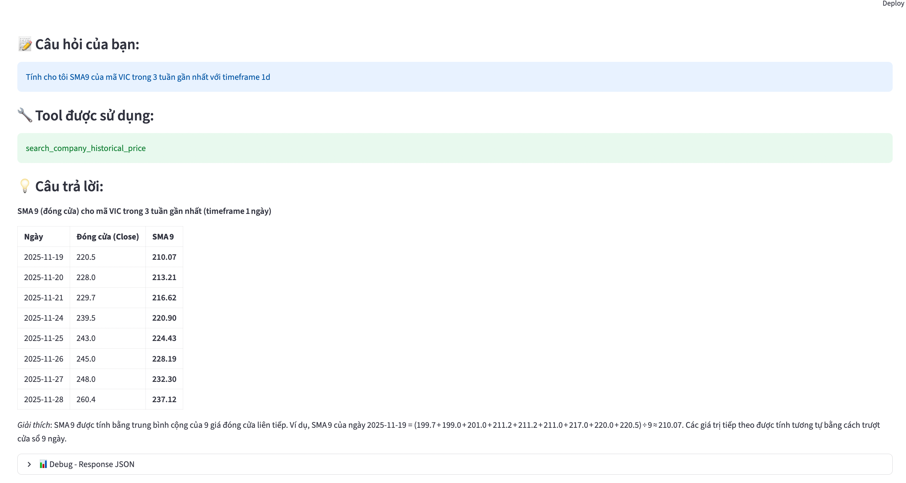

# Finance AI Agents

## Table of Contents
- [Description](#description)
- [Tech](#tech)
- [How to run the code](#how-to-run-the-code)
- [Author](#author)

## Description
This is my personal project. My aim is to create an AI agents that can retrive vietnamese stock data and perform some calculation on it like SMA, RSI, MACD and a RAG tool to run retrieve technical analysis technique in a book. Other than the demo image, you guy can check longer demo in the `auto_question_test_results.txt` file.

## Workflow

## Tech:
- I am using the vnstock api to retrieve vietnamese stock data in real time. You guy can read the documentation of the api at [https://vnstocks.com/docs](https://vnstocks.com/docs).  
- The tools for the agent are cusomize base on the API that I have mentioned above.  
- The model I use is `gpt-oss:120b-cloud` using through Ollama.  
- For RAG tool, I use the Qdrant database and `embeddinggemma:300m` through Ollama  

## How to run the code:

### 1. Run cloud model locally
1.1 Clone the repository   
   `git clone https://github.com/TrueNguyen203/Finance-AI-agent.git`  
   
1.2 Set up the model  
   - Download Ollama at [https://ollama.com/](https://ollama.com/) and open it in your computer  
   - Login in to your account  
   - You may need to ask it 1 question with the model `gpt-oss:120b-cloud` or else you can run ollama pull `gpt-oss:120b-cloud`  
   - `ollama pull embeddinggemma:300m`  

1.3 Set up qdrant database:
`docker pull qdrant/qdrant`  
`docker run -p 6333:6333 -v ./qdrant/storage qdrant qdrant`  

1.3 Setup the virtual environment  
`python -m venv venv_name`  
`venv_name\Scripts\activate`  
`pip install -r requirements.txt`  

1.4 Add document to the database:
`python src ingest.py`

1.4 Run the app  
`python src/index.py`

### 2. Dockerize model
**Alert:** If you run this way make sure that you config Nvidia GPU if is available (right now is run on GPT) click to see docs and change base_url, model in `agent.py` and model in `docker-compose.yml`  
2.1 `docker-compose build`  
2.2 `docker-compose up`   

##  Author
- Chu Cao Nguyen - nguyenmilan203@gmail.com
  
